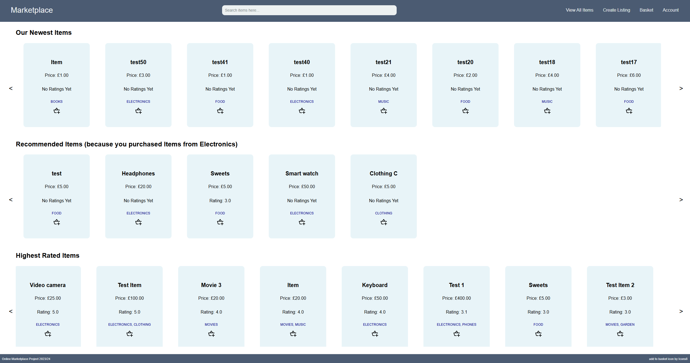

## Marketplace Project


This is the source code for my University Final Year Project.
Users can create an account and buy, trade and sell items.
There is item filtering and searching functionality for searching for specific items.
The system can also recommend items to a user based on their previous purchases and preferences using a form of machine learning/content-based filtering through finding the cosine similarity between items and users.

### How to run?
The Visual Studio Code environment is required for running the project.

Firstly, import the database file using:
`mysql -u [Username] -p Marketplace < MarketplaceDatabaseEmpty.sql`

Install the packages:
Navigate to `/marketplace-web/`
- run: `npm install`

Navigate to `/node-server/`
- run: `npm install`

You will need to create a .env file in the /node-server folder with the following format to access the database:
```bash
DB_HOST=127.0.0.1

DB_USER=[Username]

DB_PASS=[Password]

DB_NAME=Marketplace

DB_PORT=3306
```

Navigate back to `/marketplace-web/` and run the commands in multiple terminals
- run: `npm run start`
- run: `npm run watch`

Navigate back to `/node-server/` and run the commands in multiple terminals
- run: `npm run dev`
- run: `npm run watch`

These four commands: start, watch, dev, and watch need to be running at the same time for the project to work correctly

Navigate to `http://localhost:3000/` in a browser

You have now built and launched the Marketplace!